## 입원기간

<입원기간에 영향을 미치는 변수들은? >

1. 목표

'입원기간'이라는 목표변수에 영향을 미치는 설명변수들을 찾는 것.
최소 10개 이상의 설명변수를 찾아야 함.

2. 작업 절차

두 명의 사람이 협력하여 작업.
먼저, '입원기간'에 영향을 미칠 것으로 예상되는 설명변수의 목록을 선정하여 회의.
후보로 선정된 설명변수들을 두 그룹으로 나눠서 5:5 비율로 나누어 검증.
각 그룹은 해당 변수가 입원기간에 영향을 주는지 확인하기 위해 EDA와 CDA (다변수 검증) 수행.
P-값을 통해 입원기간에 영향을 주는 변수들을 최종 선택함.
최종적으로 선택된 변수들을 바탕으로 분석 내용을 정리.

3. 과제

주어진 변수들을 그대로 사용하는 것이 아니라, 필요에 따라 변경해야 함.
예를 들어, 신장과 체중을 활용하여 BMI를 생성하는 것과 같은 변형이 필요할 수 있음.
이렇게 생성된 변수들은 실제 상황을 고려하여 설계되어야 함.
예를 들어, 암 발병 여부나 당뇨 여부와 같은 변수가 입원기간에 영향을 미칠 수 있으므로 이를 고려해야 함.
변수 간의 연관성이나 영향을 주는 정도를 고려하여 최종 변수를 선택하고 검증해야 함.

4. 결론

**CDA 검증**으로 입원기간에 영향을 미치는 것으로는 **1) 연령, 2) 수술기법에 따른 수술시간, 3) 척추이동척도** 가 예상됨.

#### DDA 

| 변수 | 설명 | 유형 |
| :--: | :--: | :--: |
| 입원기간 | 소요된 입원일 수 | 연속 |
| 연령 | 나이가 많을수록 입원기간이 길어질 것으로 예상 | 연속 |
| Large Lymphocyte | 림프구 수가 적으면 다른 질병에 걸릴 확률이 높아 입원기간이 길어질 것으로 예상 | 연속 |
| 종양진행여부 | 종양진행정도에 따라 입원기간이 달라질 것으로 예상 | 범주 |
| 디스크 단면적 | 디스크 크기에 따라 수술 시간이 길어져서 입원기간에 영향을 미칠 것으로 예상 | 연속 |
| 척추이동척도 | 척추 이동 정도에 따라 디스크 정도가 다를 것으로 예상, 이는 입원기간에 영향을 미칠 것으로 예상 | 범주 |
| 수술시간 | 수술 시간이 길수록 입원기간이 길어질 것으로 예상 | 연속 |
| 수술기법 | 수술 기법별로 회복력이 다를 것으로 예상 | 범주 |
| Instability | 척추 안정성이 불안한 경우 입원기간에 영향을 미칠 것으로 예상 | 범주 |
| 혈액형 | 입원기간에 영향을 미치지 않을 것으로 예상 | 범주 |
| 신장, 체중  | BMI로 측정 예정 | 연속?범주? |
+ 성별, 우울증여부, 종양진행여부, 재발여부, 디스크위치, 척추전방위증, 수술실패여부, 흡연여부 

 EDA 

#### 연령-입원기간
- 연속-연속_ scatter, hitmap
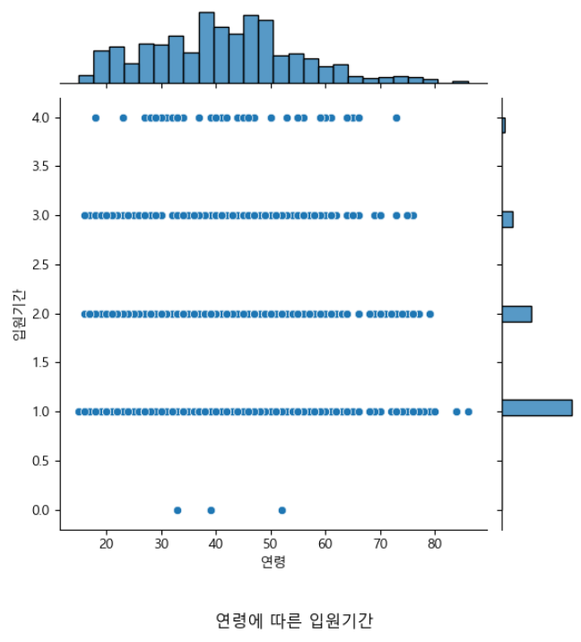

- 연령은 입원기간에 영향을 미치지 않는 것으로 보여짐. 
    - 입원기간 4주 이하에서 50대가 많이 입원하는것으로 보여짐
        
        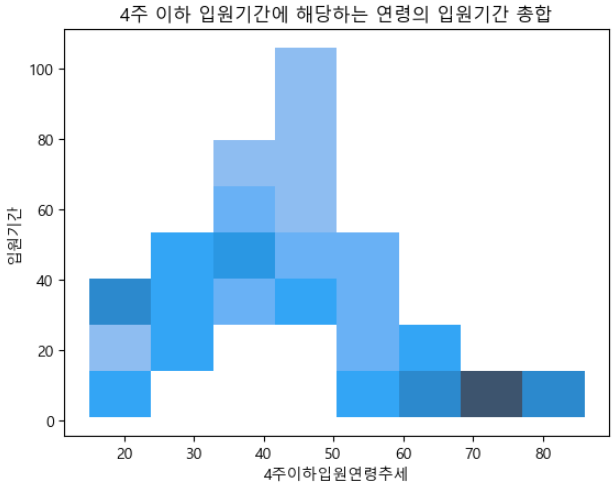

    - 입원기간 4주 초과에서 오히려 30대, 60대 많이 입원하는 것으로 보여짐 (직업 or 생활환경에 영향을 많이 받았을거같은..)
        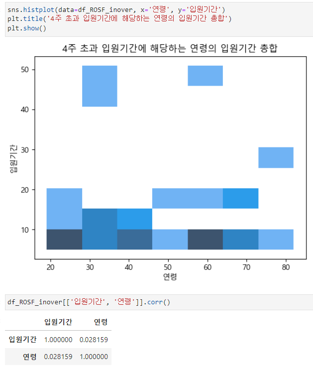

#### Large Lymphocyte-입원기간
- 연속-연속 (정상 범위 15~45(10^2)/μL )
- 림프구 수와 입원기간은 연관성이 보이지 않음. 
    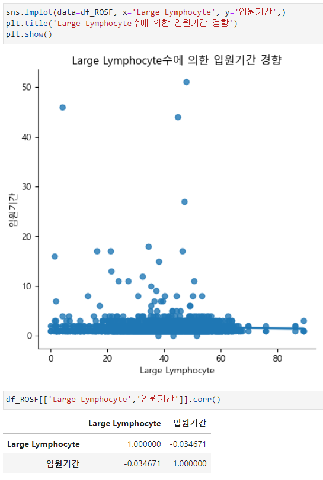
    
        
#### 종양진행여부-입원기간
- 범주-연속
- 종양 진행이 없을때보다 있을 때 입원기간이 조금 늘어나는 것으로 보이나 이의 값의 variation이 크므로 검증이 필수
    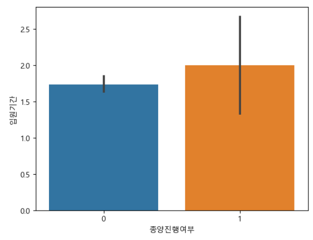

#### 종양진행여부-입원기간
- 연속-연속 
- 디스크 단위 면적이 클수록 입원기간이 늘어나지 않을까 예상함. 
    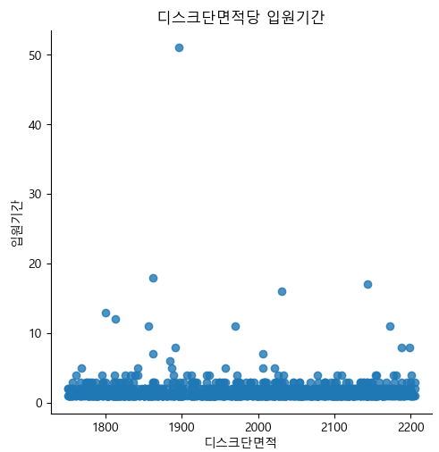
    - correlation 수치상 관계가 없을 것으로 예상됨. 

#### 척추이동척도-입원기간
- 범주-연속 
- 척추이동척도에 따라 입원기간과 연관이 있을 것으로 예상함.  
    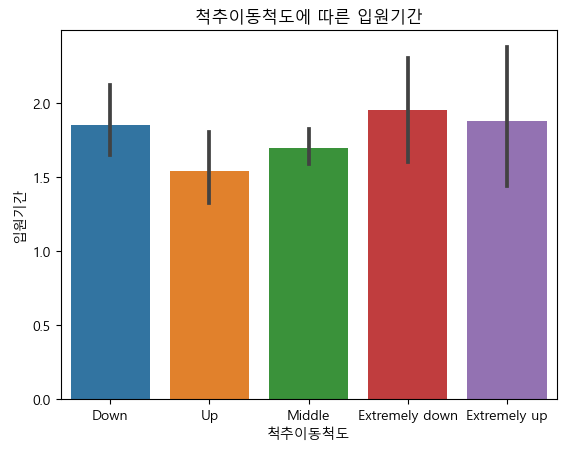

#### 수술시간-입원기간
- 연속-연속
    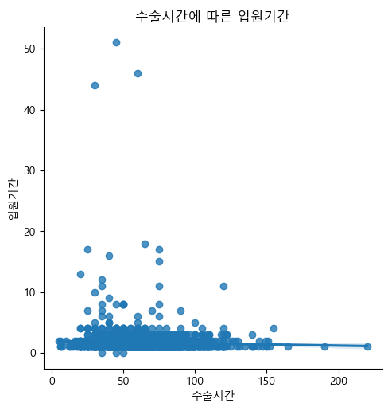

#### 수술기법-입원기간
- 범주-연속
    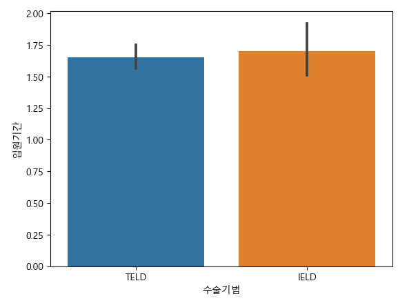

#### 척추안정성-입원기간
- 범주-연속    
    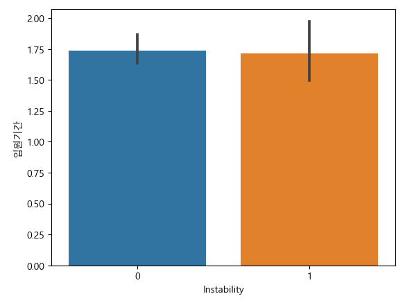

##### 혈액형-입원기간
- 범주-연속
    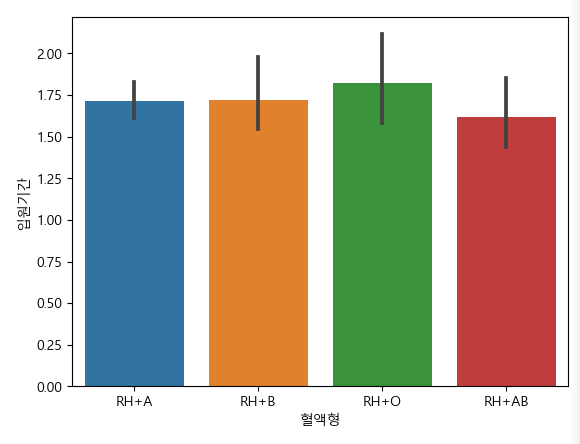

##### BMI-입원기간
- 범주-연속
    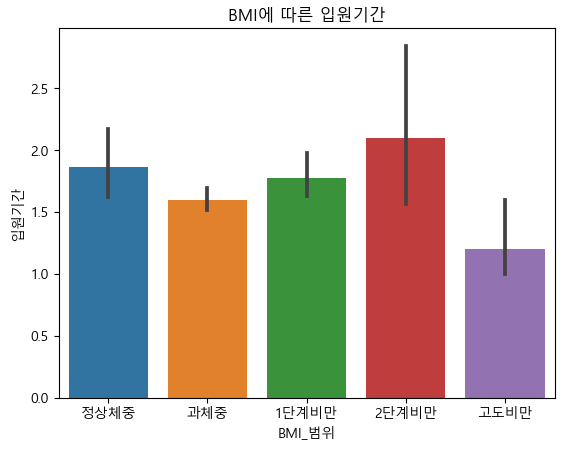

#### CDA

**- 입원기간(목표 변수) 정규성 검정**

| 항목 | 검증 | p-value | 결과 |
| --- | --- | --- | --- |
| 입원기간 | Shapiro | 0.0034 | 비정규 데이터|

- 요인과 입원기간의 검증

**입원기간**

| 항목 | 검증 | p-value | 결과 |
| --- | --- | --- | --- |
| 수술기간-수술시간 | Ranksums | 0.00024 | 수술기법-수술시간의 영향이 있으며 입원기간과도 유의미한 관계 검증|
| 척추이동척도 | Kruskal | 0.0093 | 척추이동척도에 따라 입원기간은 유의미한 변화가 있음 |

**4주 이하 입원기간**

| 항목 | 검증 | p-value | 결과 |
| --- | --- | --- | --- |
| 연령  | spearmanr | 0.0034 | 연령은 4주 이하 입원기간과 유의미한 관계임|
| Large Lymphocyte  | spearmanr | 0.1085 | 4주 이하 관계 없음. |
| 종양진행여부  | Ranksums | 0.1971 | 4주 이하 관계 없음. |
| 디스크 단면적  | spearmanr | 0.1313 | 4주 이하 관계 없음. |
| Instability  | Ranksums | 0.2789 | 4주 이하 관계 없음. |
| 혈액형  | Kruskal | 0.069 | 4주 이하 관계 없음. |
|  BMI  | Kruskal | 0.1825 | 4주 이하 관계 없음. |

**4주 초과 입원기간**

| 항목 | 검증 | p-value | 결과 |
| --- | --- | --- | --- |
| 연령  | spearmanr | 0.2836 | 4주 초과에선 관계 없음. |
| Large Lymphocyte  | spearmanr | 0.2836 | 4주 초과에선 관계 없음. |
| 종양진행여부  | Ranksums | 0.2405 | 4주 초과 관계 없음. |
| 디스크 단면적  | spearmanr | 0.1313 | 4주 초과 관계 없음. |
| 혈액형  | Kruskal | 0.2787 | 4주 초과 관계 없음. |
|  BMI  | Kruskal | 0.3001 | 4주 초과 관계 없음. |