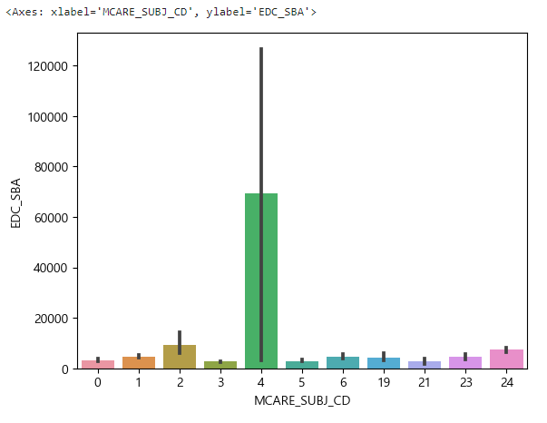
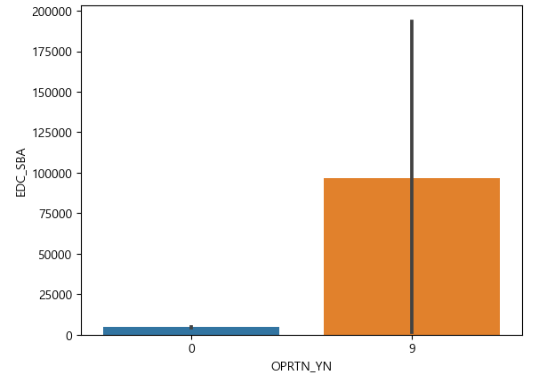
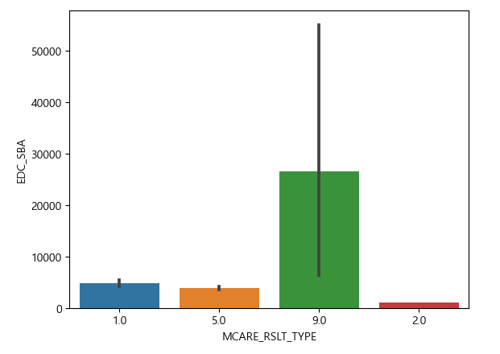

## 2. 국민건강_고혈압환자 기준
### Quest_2

<심결본인부담금에 영향을 미치는 변수는?>

1. 목표
국민건강 코호트 자료를 통해 본임부담금(목표변수)에 영향을 미치는 변수들을 알아보고자 함. 
2. 변수 선택
   - 목표 변수 : EDC_SBA 심결본인부담금(본인 부담금) 
   - 설명 변수 : BTH_YYYY, DTH_YYYYMM, MCARE_SUBJ_CD, OPRTN_YN, TOT_PRSC_DD_CNT, MCARE_RSLT_TYPE, STD_YYYY

#### DDA

| 변수 | 변수이름 | 설명 | 유형 |
| :--:| :--: | :--: | :--: |
| EDC_SBA | 심결본인부담금 | 해당 환자가 부담하는 진료비의 금액 | 연속형 |
| MCARE_SUBJ_CD | 진료 과목 코드 | 환자의 진료과목을 식별하는 코드 | 범주형 |
| OPRTN_YN | 수술 여부 | 해당 환자가 수술을 받았는지 여부 | 범주형 |
| MCARE_RSLT_TYPE	| 진료 결과 구분 | 환자의 진료 결과를 구분하는 코드 | 범주형 |

#### EDA

##### 1.EDC_SBA 심결본인부담금과 / MCARE_SUBJ_CD : 진료과목코드.
- 범주형
- 진료과목코드가 4(외과)인 경우 평균의 값(69366.666667)으로 4(외과)가 가장 많다. 

##### 2.EDC_SBA 심결본인부담금과 / OPRTN_YN 수술여부
- 범주형
- 분석결과 수술(9)한 환자들의 본인 부담금비율이 더 높은 것을 확인할 수 있음. 

##### 3.EDC_SBA 심결본인부담금과 / MCARE_RSLT_TYPE 진료결과구분
- 최종상태  1: 계속, 2: 이송, 3: 회송, 4 :사망, 9: 퇴원 또는 외래치료 종결 
- 범주형
- 9 . 퇴원 또는 외래치료 종결의 본인부담금이 가장 높은 것을 확인 할 수 있음 

#### CDA

- 내용 채우기!!