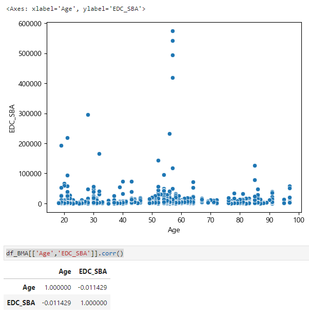
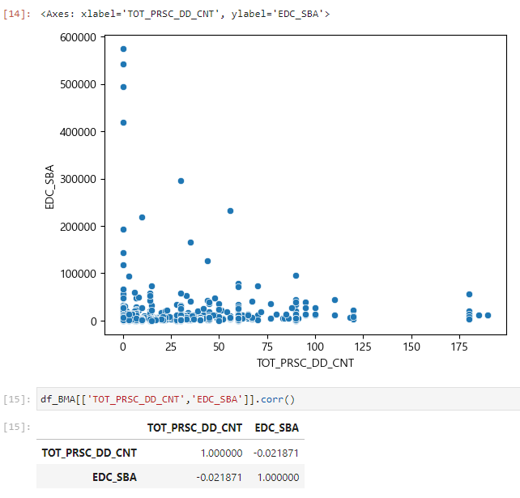
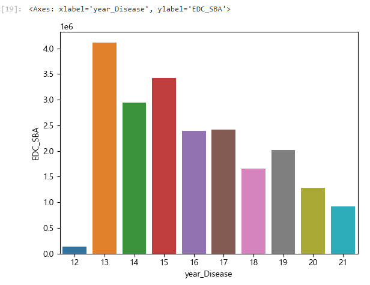

## 2. 국민건강_고혈압환자 기준
### Quest_2

 심결본인부담금에 영향을 미치는 변수는? 

1. 목표
국민건강 코호트 자료를 통해 본임부담금(목표변수)에 영향을 미치는 변수들을 알아보고자 함. 
2. 변수 선택
   - 목표 변수 : EDC_SBA 심결본인부담금(본인 부담금) 
   - 설명 변수 : BTH_YYYY, DTH_YYYYMM, MCARE_SUBJ_CD, OPRTN_YN, TOT_PRSC_DD_CNT, MCARE_RSLT_TYPE, STD_YYYY

 DDA 

 MJ 

| 변수 | 기준변경 | 설명 | 유형 |
| :--:| :--: | :--: | :--: |
| EDC_SBA | 심결본인부담금 | 해당 환자가 부담하는 진료비의 금액 | 연속형 |
| MCARE_SUBJ_CD | 진료 과목 코드 | 환자의 진료과목을 식별하는 코드 | 범주형 |
| OPRTN_YN | 수술 여부 | 해당 환자가 수술을 받았는지 여부 | 범주형 |
| MCARE_RSLT_TYPE	| 진료 결과 구분 | 환자의 진료 결과를 구분하는 코드 | 범주형 |

 SA 

| 변수 | 기준변경 | 설명 | 유형 |
| :--:| :--: | :--: | :--: |
| EDC_INSUR_BRDN_AMT | 심결본인부담금 | 해당 환자가 부담하는 진료비의 금액 | 연속형 |
| BTH_YYYY | 2023-BTH_YYYY = 현재연령 | 출생년도를 바탕으로 2023년 현재 나이를 계산한 값 | 연속형 |
| TOT_PRSC_DD_CNT | 총 처방일수 | 해당 환자가 처방받은 약품의 총 일 수 | 연속형 |
| STD_YYYY| 수신자가 진료를 받은 연도 | 해당 환자가 처음으로 진료를 받은 년도 | 연속형 |

 EDA 

 MJ 

 SA 

#### 연령-심결본인부담금
- 연속-연속
- lmplot?histplot?scatter?
-  ⇒ 전체 연관성이 보이지 않음. 
-  ⇒ 50-60 대 사이에서 본인부담금이 높은것으로 보여짐. 
- 

####  총 처방일수-심결본인부담금
- 연속-연속
- TOT_PRSC_DD_CNT scatter?
-  ⇒ 총 처방일수와 본인부담금의 연관성이 보이지 않음. 
- 

###  질병년차-심결본인부담금
- 범주-연속
- disease_year: 2023- 첫 진료받은 년도
- ⇒ 진료진단 받은 년차가 오래되었을수록 본인부담금의 누적이 클것이라고 예상했으나 13년차에서 가장 많았음. 다른 이유가 있을것으로 예상됨. 
- 

